# Machine Learning Integrated to Endotracheal Tube Insertion

### Programs In This Project

1. #### train.py
    Trains a model based on a current version of a model and a specific dataset while maintaining a record of model versioning.

    Usage:
    ```bash
    python train.py --model_name <model_name> --dataset_name <dataset_name> --run_number <run_number>
    ```

    Command-Line Arguments:
    - `--model_name` (required):  
    The folder name in the `runs/detect/` directory containing the model file to train on.  
    Example: `train3`

    - `--dataset_name` (required):  
    The folder name in the `datasets/` directory containing the dataset to use for training.  
    Example: `90258_001`

    - `--run_number` (required):  
    An integer representing the current training iteration. This is included in the version naming convention (`trainN`). The training results will be saved to a new folder within `runs/detect/` called `trainN`.  
    Example: `4`

    Logging:
    After training, the script logs the details of the new model version into a CSV file named `model_versions.csv`.

2. #### test.py
    Validates the model on a specific dataset while maintaining a record of testing history.

    Usage:
    ```bash
    python test.py --model_name <model_name> --dataset_name <dataset_name> --run_number <run_number>
    ```

    Command-Line Arguments:
    - `--model_name` (required):  
    The folder name in the `runs/detect/` directory containing the model file to test.  
    Example: `train3`

    - `--dataset_name` (required):  
    The folder name in the `datasets/` directory containing the dataset to use for testing.  
    Example: `90258_001`
    - `--run_number` (required):  
    An integer representing the current testing iteration. This is included in the testing naming convention (`valN`). The testing results will be saved to a new folder within `runs/detect/` called `valN`.  
    Example: `1`

    Logging: After testing, the script logs the details of the test run into a CSV file named `test_history.csv`.

3. #### predict.py
    Runs the model through a video, predicting the locations of features in the video. There is the option to playback the video as it predicts, or save the predicted video to a new file in full_predicted_videos/.

4. #### convert_format_and_train_test_split.py
    Converts the data format from the downloaded CVAT annotations to the format we need.

5. #### create_combined_dataset.py
    Combines multiple datasets into a single dataset folder (`combined_dataset`) by creating symbolic links to their images and labels. It also generates a `data.yaml` configuration file for YOLOv8 training or validation.  (Due to YOLOv8's potential inability to resolve relative paths in symbolic links, the script uses absolute paths, and the symbolic links are ignored by `.gitignore` to account for machine-specific file paths. You need to recreate them on different machines by re-running the script.)

    Usage:
    - Combine All Datasets
    ```bash
    python create_combined_dataset.py --for_all
    ```
    - Add a Specific Dataset
    ```bash
    python create_combined_dataset.py --source_folder <source_folder>
    ```

    Command-Line Arguments:
    - `--for_all`:  
    Combine all datasets within the `datasets/` directory into `combined_dataset`. When using `--for_all`, the script removes all existing symbolic links in combined_dataset before recreating them.
    
    - `--source_folder`:  
    Add a single dataset (specified by folder name) to the `combined_dataset` incrementally without affecting existing links.  
    Example: `098513213_001`

    **Note**: Either `--for_all` or `--source_folder` must be provided, but not both.

    Output Structure: 
    The script creates the following directory structure in `datasets/combined_dataset/`:
    ```css
    combined_dataset/
    ├── training/
    │   ├── images/ (symbolic links to images for training from all source datasets)
    │   ├── labels/ (symbolic links to labels for training from all source datasets)
    ├── validation/
    │   ├── images/ (symbolic links to images for validation from all source datasets)
    │   ├── labels/ (symbolic links to labels for validation from all source datasets)
    ├── data.yaml
    ```
    The `data.yaml` file is generated with the following format:
    ```yaml
    datasets_contained: [all source datasets. e.g.: 90258_001, 098513213_001]
    train: ./training/images
    val: ./validation/images
    nc: 3
    names: ['trachea', 'epiglottis', 'uvula']
    ```


### Model Notes
As of 9-16-24, the value of 
```
model.names
```
from the most recent model (runs/detect/train3/weights/best.pt) is:
```
{0: 'trachea', 1: 'epiglottis', 2: 'uvula'}
```
Model Training/Data History:
| Date | New Trained Model Version | Additional Video(s) Trained On | Notes |
| - | - | - | - |
| Start of Autumn 2024 semester | runs/detect/train3/weights/best.pt | N/A | |
| 10-28-2024 | runs/detect/train32 | 004080945_001 | 11 epochs |
| 10-28-2024 | runs/detect/train33 | 010878657_001 | 11 epochs |
| 11-14-2024 | runs/detect/train36 | 047217044_001 | 11 epochs |


Model Testing History:
| Date | Test Results Directory | Model File Tested | Dataset Tested On |
| - | - | - | - |
| 10-28-2024 | run/detect/val14 | runs/detect/train3 | 004080945_001 |
| 10-28-2024 | run/detect/val15 | runs/detect/train32 | 004080945_001 |
| 10-28-2024 | run/detect/val8 | runs/detect/train3 | 047217044_001 |
| 10-28-2024 | run/detect/val9 | runs/detect/train33 | 047217044_001 |

### Instructions for preparing data for training using CVAT

1. Create an account and organization on CVAT:

    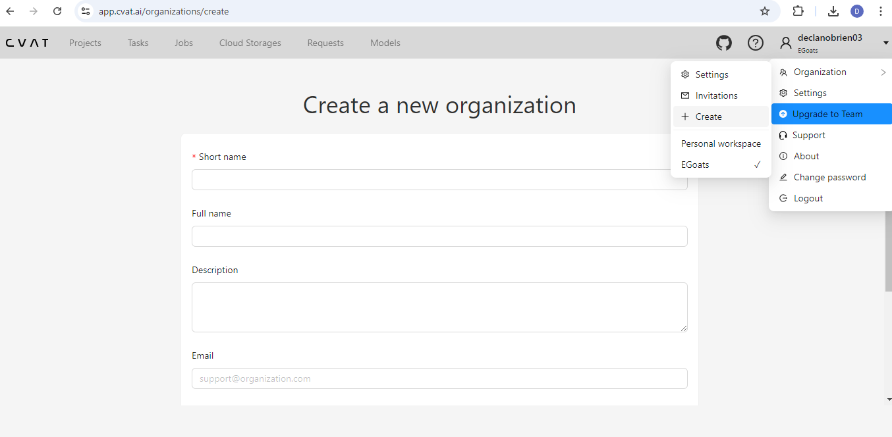

    When working on this project in CVAT, make sure you are in the correct organization, not "Personal Workspace" or another organization.

2. Create a new project within this organization. When creating the project, be sure to add the labels: ['trachea', 'epiglottis', 'uvula']. It's important to ensure the order is consistent with the class label numbers (trachea = 0, etc.).

    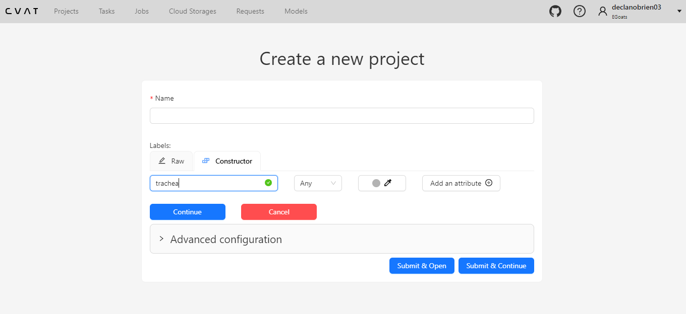
    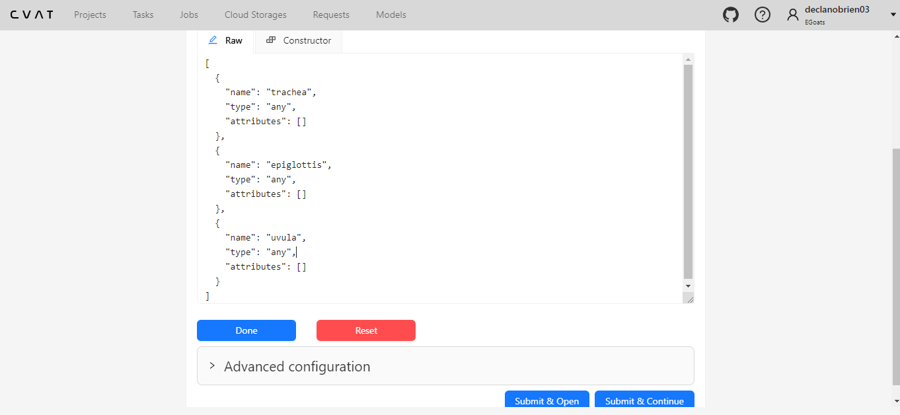

3. Download the video you want to annotate from the google sheet titled
["Video Annotation Progress"](https://docs.google.com/spreadsheets/d/1T86gqUQacowGvsDeFqO6eBcgxWp41lqLjR3G9PPORe8/edit?usp=sharing).

4. Navigate to this project and create a new task for each video you want to annotate. Upload the desired video to this task.

    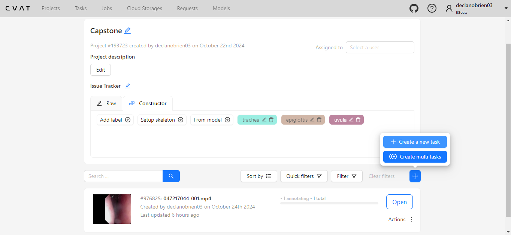
    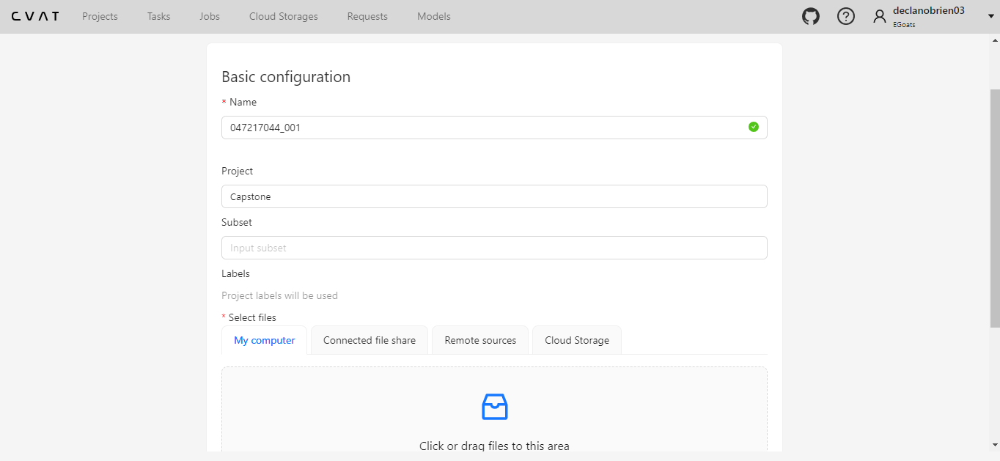

5. Within the task, click the job.

    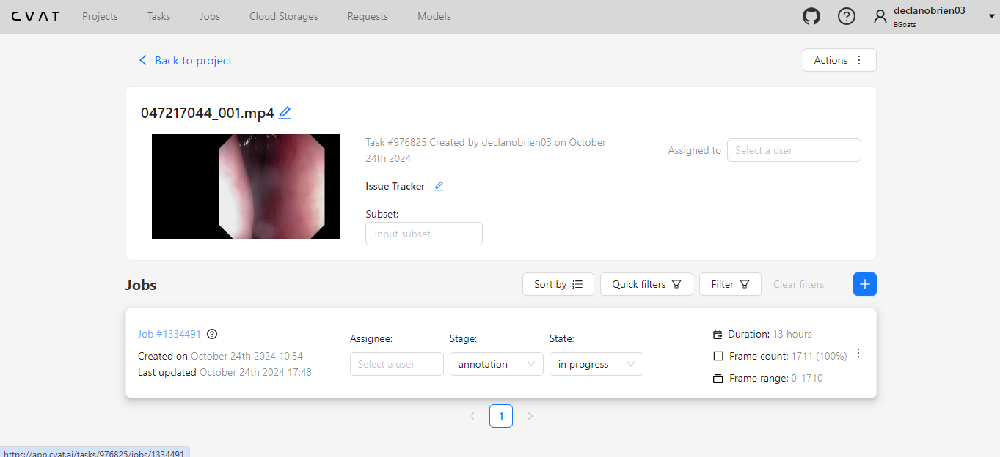

6. Annotation instructions:
    1. Navigate through the frames of the video using the buttons above the video or using the left and right arrow keys. When you see a feature, click the rectangle on the left. Click the correct feature name, Drawing Method: By 2 Points, and then Track.

    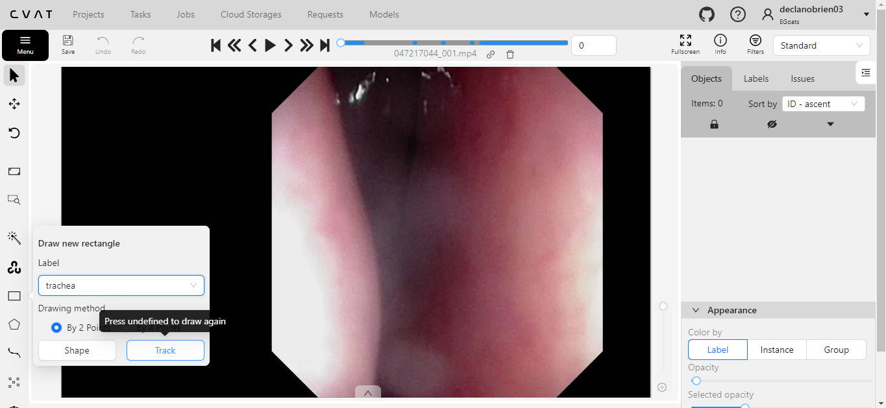

    2. As you advance through the video, move the annotation box appropriately. Make sure to press the save button often. You can use the "v" key to skip forward 10 frames. If you then move the feature annotation box on this frame, CVAT will interpolate the annotation for the middle 9 frames. Note that this may not be the most accurate, but is usually helpful.

    3. If a feature is no longer visible, press the button on the right to "Switch outside property". You will then have to redraw the box if/when the feature reappears.

    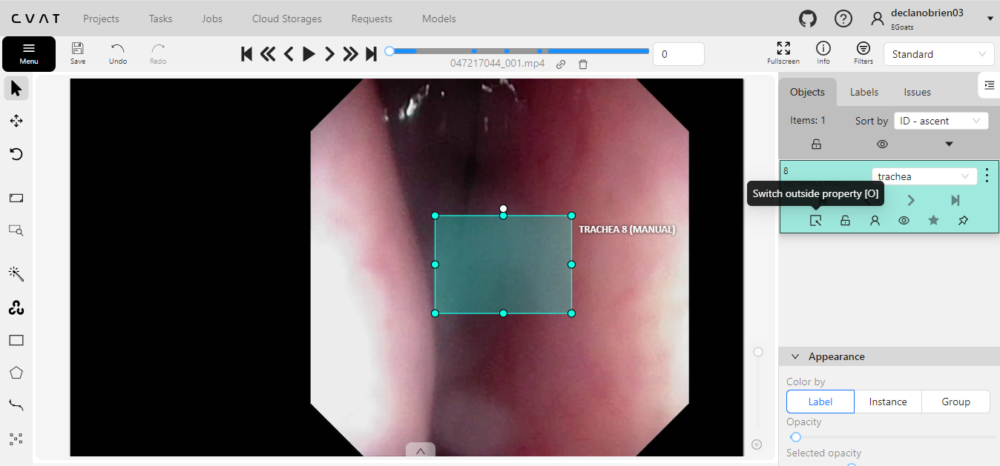

7. When you are finished annotating, return back to the job. Click export annotations.

    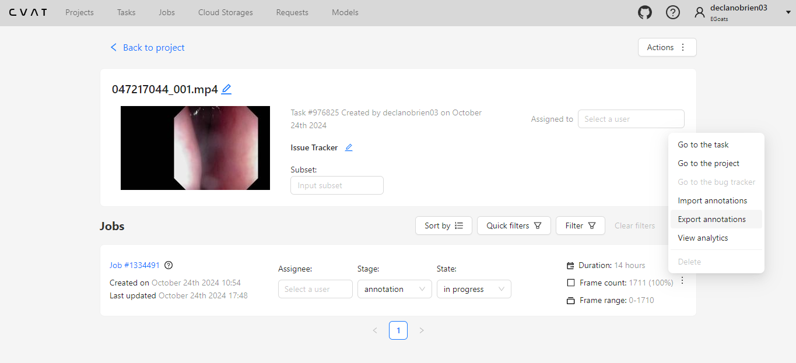

8. Select "YOLOv8 Detection 1.0" for Export Format and name the dataset the same as the video name. Download the zip.

    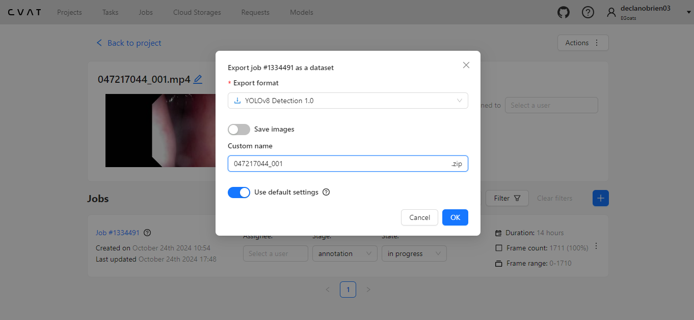

9. Extract the contents of the zip and place it in this repo in the folder: datasets_exported_from_cvat/ along with the source video file. There is a paywall to export the images along with the labels from CVAT so we need to extract them from the video.

    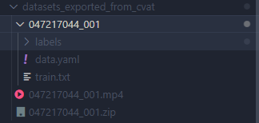

10. Run convert_format_and_train_test_split.py with the correct dataset name. After running this, the dataset should be ready to further train a previous model version.

    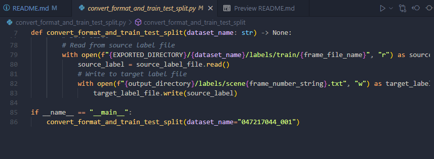